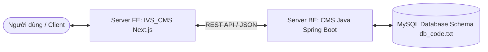

# CMS Backend API — Java Spring Boot (Backend Server)

Dự án **CMS Backend** đóng vai trò là **Server BE (Backend)** chính thức trong định hướng kiến trúc tổng thể của hệ thống CMS, kết nối và cung cấp dịch vụ cho **Server FE (Frontend)** là dự án **`IVS_CMS`** (Next.js).

> [!NOTE]
> **Định hướng mã nguồn**: Mã nguồn Java Spring Boot hiện tại được sử dụng làm **Bộ khung mã mẫu (Reference Standard Architecture)** nhờ cấu trúc phân lớp tối ưu, thiết lập Spring Security, JWT và Spring JDBC mẫu chuẩn.
> **Cơ sở dữ liệu chính thức**: Mô hình cơ sở dữ liệu định hướng cho dự án được quy định tại tệp [`docs/db_code.txt`](./docs/db_code.txt) và phân tích tại [`docs/05-database-schema.md`](./docs/05-database-schema.md).

---

## 🗺️ Định Hướng Hệ Thống (System Roadmap)



- **Server FE (`IVS_CMS`)**: Giao diện người dùng và trang quản trị viết bằng Next.js (App Router).
- **Server BE (`CMS`)**: Xử lý logic nghiệp vụ, bảo mật JWT, phân quyền chi tiết, quản lý nội dung và cơ sở dữ liệu.
- **Database Specification (`db_code.txt`)**: Định nghĩa 18 bảng dữ liệu chuẩn (Users, Roles, Permissions, Actions, APIs, Posts, Categories, Tags, Media Library, Reviews, Forms, General Info, Audit Logs, Refresh Tokens, Blacklist).

---

## 🚀 Công Nghệ Sử Dụng (Backend Core)

- **Language & Runtime**: Java 21 (JDK 21)
- **Framework**: Spring Boot 3.5.x
- **Security**: Spring Security 6, OAuth2 Resource Server, JWT (HS512 Algorithm)
- **Database Layer**: Spring JDBC (`NamedParameterJdbcTemplate`) & MySQL 8.x
- **API Documentation**: SpringDoc OpenAPI / Swagger UI (`org.springdoc`)
- **Build Tool**: Gradle (Groovy DSL)
- **Utilities**: Lombok, Jackson, Java Mail Starter

---

## ⚡ Khởi Động Nhanh

### 1. Yêu cầu hệ thống
- **Java Development Kit (JDK)**: Phiên bản 21 trở lên.
- **MySQL Database**: Phiên bản 8.0 trở lên (đang chạy tại `localhost:3306`).

### 2. Cấu hình môi trường
Tạo file `.env` từ file mẫu `.env.example` tại thư mục gốc của dự án:

```bash
# Tạo file .env (trên Windows PowerShell)
Copy-Item .env.example .env
```

Mở file `.env` và điều chỉnh các thông số phù hợp:
```env
DB_URL=jdbc:mysql://localhost:3306/CMS
DB_USERNAME=root
DB_PASSWORD=your_mysql_password
JWT_SECRET=ZGFmNDhjNWM1MmM3NDJjMzU5YjU5MjJkMzM4NTRmNTM5N2Q5ZjFjZDU5MzJhNDIzNTg2MDNhYTllZGViMzI4Zg==
```

### 3. Khởi tạo cơ sở dữ liệu
Đảm bảo bạn đã tạo Database `CMS` trong MySQL:
```sql
CREATE DATABASE IF NOT EXISTS CMS CHARACTER SET utf8mb4 COLLATE utf8mb4_unicode_ci;
```

### 4. Chạy ứng dụng

```bash
# Trên Windows (PowerShell / CMD)
.\gradlew.bat bootRun

# Trên Linux / macOS
./gradlew bootRun
```

Ứng dụng sẽ khởi chạy tại cổng **`8080`**.

---

## 📚 Tài Liệu Kỹ Thuật Nội Bộ

Hệ thống tài liệu chi tiết được lưu trữ trong thư mục [`/docs`](./docs):

| File Tài Liệu | Nội Dung Chi Tiết |
| :--- | :--- |
| 🏗️ [docs/01-architecture-and-structure.md](./docs/01-architecture-and-structure.md) | Cấu trúc thư mục, phân lớp dự án (Controller → Service → Repository → Domain) |
| 📏 [docs/02-coding-conventions.md](./docs/02-coding-conventions.md) | Quy chuẩn viết code Java, Naming convention, Lombok, Error Handling & Response DTOs |
| 🔒 [docs/03-environment-and-security.md](./docs/03-environment-and-security.md) | Cấu hình biến môi trường, Spring Security, JWT (Access & Refresh), Phân quyền RBAC |
| 🌐 [docs/04-api-documentation.md](./docs/04-api-documentation.md) | Danh sách REST APIs, Swagger UI URL, Header Authentication, Request/Response payload |
| 🗄️ [docs/05-database-schema.md](./docs/05-database-schema.md) | Thiết kế DB chính thức từ [`db_code.txt`](./docs/db_code.txt) (18 bảng: Posts, Media, Forms, RBAC, Audit) |
| 📄 [docs/db_code.txt](./docs/db_code.txt) | File định nghĩa DBML gốc của hệ thống cơ sở dữ liệu |

---

## 📖 Swagger UI & API Testing

Khi server đang chạy, bạn có thể truy cập giao diện Swagger UI để trải nghiệm và test API:

- **Swagger UI**: [http://localhost:8080/swagger-ui.html](http://localhost:8080/swagger-ui.html)
- **OpenAPI Spec**: [http://localhost:8080/v3/api-docs](http://localhost:8080/v3/api-docs)

---

## 🛠️ Các Lệnh Gradle Thường Dùng

| Lệnh Executable | Mục Đích |
| :--- | :--- |
| `.\gradlew.bat bootRun` | Chạy ứng dụng ở môi trường Development |
| `.\gradlew.bat compileJava` | Biên dịch code Java để kiểm tra lỗi cú pháp |
| `.\gradlew.bat test` | Chạy unit tests và integration tests |
| `.\gradlew.bat build` | Build file JAR thành phẩm trong thư mục `build/libs/` |
| `.\gradlew.bat clean` | Dọn dẹp thư mục build cũ |

---

## 🤝 Kết Nối Frontend (IVS_CMS)

Server Backend này kết nối trực tiếp với Server Frontend Next.js tại repository `IVS_CMS`. 
Vui lòng tham khảo file [`IVS_CMS/README.md`](../IVS_CMS/README.md) để biết thêm chi tiết về cấu hình kết nối Cross-Origin (CORS).
