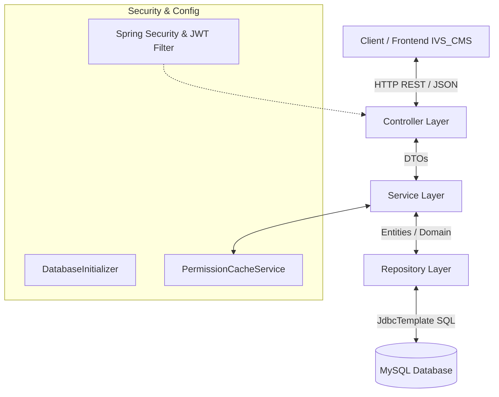

# 01. Cấu Trúc Dự Án và Kiến Trúc Mô Hình (Architecture & Structure)

Tài liệu này mô tả tổng quan về kiến trúc phần mềm, cách tổ chức package và phân chia trách nhiệm giữa các lớp trong dự án **CMS Backend (Spring Boot)**.

---

## 🏛️ Kiến Trúc Tổng Quan (Layered Architecture)

Hệ thống được thiết kế theo mô hình **Phân lớp tiêu chuẩn (Layered Architecture)** với nguyên tắc tách biệt trách nhiệm (Separation of Concerns):



### Chi tiết các lớp:

1. **Controller Layer (`IVS.CMS.controllers`)**:
   - Định nghĩa các REST API endpoints (`@RestController`, `@RequestMapping`).
   - Xử lý các Annotation phân quyền API (như `@PreAuthorize("hasAuthority('...')")`).
   - Validate thông tin đầu vào bằng Bean Validation (`@Valid`).
   - Chuyển đổi dữ liệu và phản hồi dưới dạng DTO đồng nhất (`RestResponse<T>`).

2. **Service Layer (`IVS.CMS.services`)**:
   - Nơi chứa toàn bộ logic nghiệp vụ (Business Logic).
   - Quản lý mã hóa mật khẩu (`PasswordEncoder`), tạo và giải mã JWT (`SecurityService`).
   - Quản lý Cache phân quyền động của người dùng (`PermissionCacheService`).
   - Xử lý upload tập tin đại diện (`FileUploadService`).

3. **Repository Layer (`IVS.CMS.repositories`)**:
   - Tương tác trực tiếp với cơ sở dữ liệu MySQL sử dụng **Spring JDBC (`NamedParameterJdbcTemplate`)**.
   - Sử dụng các lớp `RowMapper` thủ công trong `repositories.rowMapper` để ánh xạ dữ liệu từ `ResultSet` sang Java Objects một cách tối ưu hiệu năng.

4. **Domain Layer (`IVS.CMS.domain`)**:
   - Chứa các POJO đại diện cho bảng dữ liệu: `User`, `Role`, `Permission`.
   - Package `dto`: Chứa Request/Response DTOs bảo vệ dữ liệu thực tế của Entity khỏi việc bị trích xuất trực tiếp ra API.
   - Package `constants`: Chứa các Enum cấu hình (ví dụ: `GenderEnum`).

5. **Configuration Layer (`IVS.CMS.config`)**:
   - `SecurityConfiguration`: Cấu hình Spring Security 6, JWT Filter, Stateless session management.
   - `CorsConfig`: Cấu hình cho phép Cross-Origin requests từ Frontend (`http://localhost:3000`).
   - `DatabaseInitializer`: Tự động tạo bảng MySQL và seed dữ liệu khởi tạo mặc định.
   - `CustomAuthenticationEntryPoint`: Xử lý ngoại lệ 401 Unauthorized khi JWT không hợp lệ hoặc hết hạn.

---

## 📂 Sơ Đồ Cấu Trúc Package Chi Tiết

```text
CMS/
├── src/
│   ├── main/
│   │   ├── java/
│   │   │   └── IVS/
│   │   │       └── CMS/
│   │   │           ├── CmsApplication.java                # Main Entry Point
│   │   │           ├── config/                            # Cấu hình Spring Security, CORS, DB Init
│   │   │           │   ├── CorsConfig.java
│   │   │           │   ├── CustomAuthenticationEntryPoint.java
│   │   │           │   ├── DatabaseInitializer.java
│   │   │           │   ├── SecurityConfiguration.java
│   │   │           │   ├── UserDetailsCustom.java
│   │   │           │   └── WebConfig.java
│   │   │           ├── controllers/                       # REST Controllers
│   │   │           │   ├── AuthController.java
│   │   │           │   ├── UserController.java
│   │   │           │   ├── RoleController.java
│   │   │           │   └── PermissionController.java
│   │   │           ├── domain/                            # Entities, DTOs & Constants
│   │   │           │   ├── User.java
│   │   │           │   ├── Role.java
│   │   │           │   ├── Permission.java
│   │   │           │   ├── constants/
│   │   │           │   │   └── GenderEnum.java
│   │   │           │   └── dto/
│   │   │           │       ├── request/
│   │   │           │       └── response/
│   │   │           ├── repositories/                      # Spring JDBC Data Access
│   │   │           │   ├── UserRepository.java
│   │   │           │   ├── RoleRepository.java
│   │   │           │   ├── PermissionRepository.java
│   │   │           │   ├── impl/
│   │   │           │   └── rowMapper/
│   │   │           └── services/                          # Business Logic Services
│   │   │               ├── SecurityService.java
│   │   │               ├── UserService.java
│   │   │               ├── RoleService.java
│   │   │               ├── PermissionService.java
│   │   │               ├── PermissionCacheService.java
│   │   │               ├── FileUploadService.java
│   │   │               └── impl/
│   │   └── resources/
│   │       ├── application.properties                     # File cấu hình chính của Spring Boot
│   │       ├── static/
│   │       └── templates/
├── docs/                                                  # Tài liệu kỹ thuật & DB Specification
│   ├── db_code.txt                                        # DBML Schema chính thức của hệ thống
│   ├── 01-architecture-and-structure.md
│   ├── 02-coding-conventions.md
│   ├── 03-environment-and-security.md
│   ├── 04-api-documentation.md
│   └── 05-database-schema.md
├── .env                                                   # Biến môi trường local (Git ignored)
├── .env.example                                           # File mẫu cấu hình biến môi trường
├── .gitignore                                             # Cấu hình Git ignore
├── build.gradle                                           # Gradle dependencies & build scripts
└── README.md                                              # Trang chủ hướng dẫn dự án
```

---

## 📌 Nguyên Tắc Thiết Kế Dự Án

1. **Spring JDBC over JPA**: Dự án chủ động sử dụng `NamedParameterJdbcTemplate` cho các truy vấn SQL để đạt được hiệu năng cao nhất, hoàn toàn kiểm soát câu lệnh SQL và tránh các vấn đề N+1 Query của ORM.
2. **Stateless Authentication**: Không duy trì Session ở Server side. Mọi yêu cầu xác thực đều dựa trên JWT token được gửi qua Header `Authorization: Bearer <token>`.
3. **Strict DTO Usage**: Không bao giờ trả trực tiếp Entity ra bên ngoài API. Mọi dữ liệu vào/ra đều thông qua DTOs được đóng gói trong `RestResponse<T>`.
