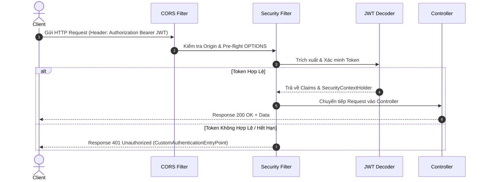

# 03. Cấu Hình Môi Trường & Bảo Mật (Environment & Security)

Tài liệu này chi tiết hóa cơ chế quản lý môi trường phát triển, kiến trúc Spring Security 6, phương thức xác thực JWT và mô hình phân quyền **RBAC (Role-Based Access Control)** trong ứng dụng **CMS Backend**.

---

## ⚙️ 1. Quản Lý Môi Trường Phát Triển (.env)

Hệ thống tách biệt hoàn toàn cấu hình nhạy cảm khỏi mã nguồn dự án thông qua cơ chế nạp biến môi trường từ file `.env`.

### 🔑 Các Biến Môi Trường Quan Trọng:

| Tên Biến Môi Trường | Mô Tả | Giá Trị Mặc Định |
| :--- | :--- | :--- |
| `SERVER_PORT` | Cổng HTTP lắng nghe | `8080` |
| `DB_URL` | Chuỗi kết nối JDBC MySQL | `jdbc:mysql://localhost:3306/CMS` |
| `DB_USERNAME` | Tài khoản truy cập Database | `root` |
| `DB_PASSWORD` | Mật khẩu truy cập Database | `Z1xcvbnm@` |
| `JWT_SECRET` | Khóa bí mật Base64 mã hóa HS512 (512-bit) | *(Random Base64 Key)* |
| `JWT_ACCESS_TOKEN_VALIDITY_SECONDS` | Thời gian sống Access Token (giây) | `8640000` (100 ngày) |
| `JWT_REFRESH_TOKEN_VALIDITY_SECONDS` | Thời gian sống Refresh Token (giây) | `8640000` |
| `MAIL_USERNAME` | Email gửi SMTP | *(Tùy chọn)* |
| `MAIL_PASSWORD` | Mật khẩu ứng dụng SMTP | *(Tùy chọn)* |
| `DEFAULT_ADMIN_EMAIL` | Email Admin khởi tạo mặc định | `admin@cms.local` |
| `DEFAULT_ADMIN_PASSWORD` | Mật khẩu Admin khởi tạo mặc định | `Admin@123456` |

---

## 🔐 2. Kiến Trúc Spring Security 6

Ứng dụng hoạt động theo mô hình **Stateless Security** (không lưu Session phía Server):

### Điểm nổi bật trong Cấu hình Security (`SecurityConfiguration.java`):

1. **Permit All Endpoints**:
   - `/` (Home page)
   - `/api/v1/auth/login` (Đăng nhập)
   - `/api/v1/auth/refresh` (Lấy token mới từ Refresh Token)
   - `/v3/api-docs/**`, `/swagger-ui/**`, `/swagger-ui.html` (Tài liệu OpenAPI)
   - `/uploads/**` (Các tập tin công khai)
2. **Protected Endpoints**: Tất cả các đường dẫn API khác yêu cầu JWT Bearer Token hợp lệ.
3. **Session Management**: Thiết lập `SessionCreationPolicy.STATELESS`.

---

## 🔑 3. Cơ Chế Xác Thực JWT (JSON Web Token)

Dự án sử dụng thuật toán mã hóa **HS512** với Secret Key đạt độ dài chuẩn 512-bit (64-bytes) mã hóa dưới dạng Base64.

### Đăng nhập & Tạo Token:
- Khi người dùng đăng nhập thành công qua `/api/v1/auth/login`, `SecurityService` tạo ra **Access Token** chứa các thông tin Claim:
  - `sub`: Email người dùng.
  - `token_type`: `"access"` hoặc `"refresh"`.
  - `user`: Thông tin cơ bản (ID, email, họ tên, avatarUrl, roleName).
- Refresh Token được lưu dưới dạng **HTTP-Only Cookie** (hoặc trả về payload) giúp bảo vệ trước các cuộc tấn công XSS.

---

## 🛡️ 4. Phân Quyền Động (Dynamic RBAC & Permission Caching)

Hệ thống triển khai phân quyền dựa trên Vai trò (Role) và Quyền hạn (Permission) được lưu trữ trong Database:

- **Users** ↔ **Roles** (Quan hệ N-1 hoặc N-N)
- **Roles** ↔ **Permissions** (Quan hệ N-N)

### `PermissionCacheService`:
Để tối ưu hiệu năng và tránh truy vấn Database liên tục cho mỗi Request, `PermissionCacheService` lưu bộ nhớ Cache danh sách đường dẫn API (`api_path`) và phương thức (`method`) mà từng Role được phép truy cập.

---

## 🌐 5. Cấu Hình CORS (Cross-Origin Resource Sharing)

File `CorsConfig.java` cho phép ứng dụng Frontend (Next.js chạy tại `http://localhost:3000`) gọi API an toàn:

- **Allowed Origins**: `http://localhost:3000` (hoặc cấu hình động).
- **Allowed Methods**: `GET`, `POST`, `PUT`, `DELETE`, `OPTIONS`, `PATCH`.
- **Allowed Headers**: `Authorization`, `Content-Type`, `X-Requested-With`, `Accept`.
- **Allow Credentials**: `true` (Cho phép gửi Cookies & Authentication Headers).
